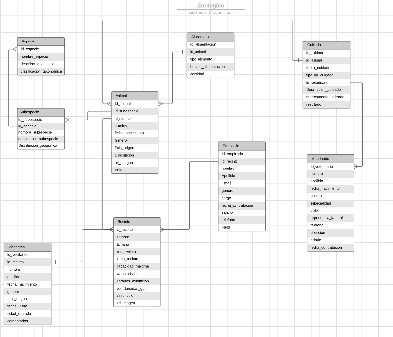
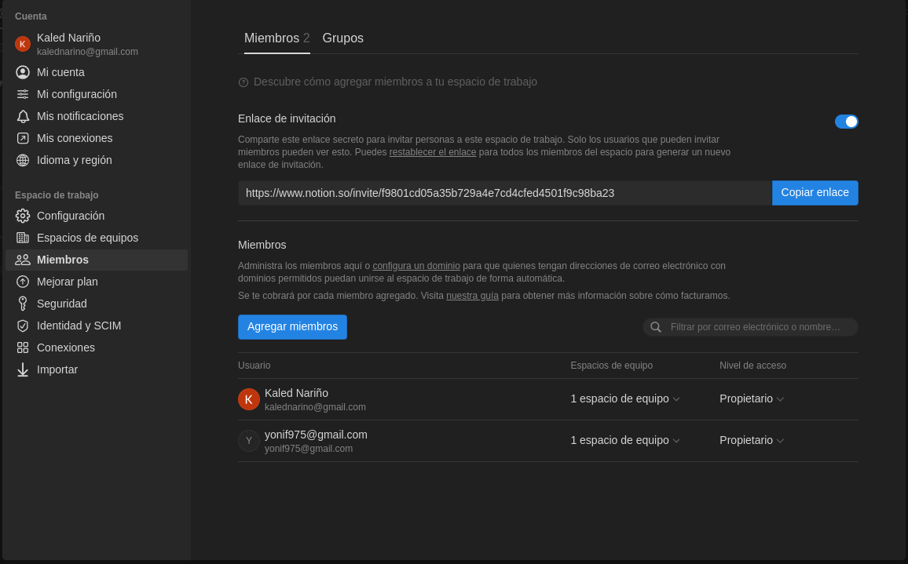
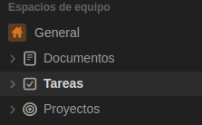
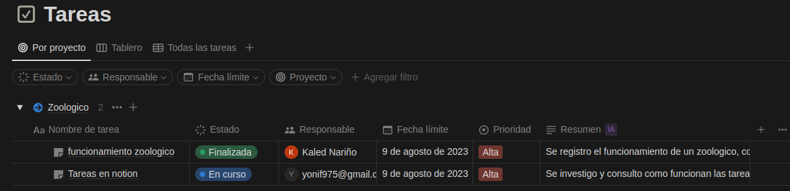

# Martes 08 de Agosto:

## -  Notas de zoologico

### Funcionamiento | Fin 

Un jardín zoológico, o simplemente zoológico, es un lugar donde los animales salvajes viven divididos en diferentes recintos. Su principal fin es el de educar a la población, brindar un espacio de esparcimiento al público y estudiar/preservar a las especies.

### Caracteristicas 
 
 - Todas las actividades y las tareas de conservación y mantenimiento que se llevan a cabo dentro de los zoos parten del respeto hacia los animales. El bienestar de todos los animales del zoo es el pilar básico sobre el que se debe asentar el plan de acción de cada parque 
 
 - Las instalaciones están concebidas para garantizar la total seguridad de los animales y de las personas. Hoy en día el diseño de los zoos tiende a ocultar las barreras de protección para crear una sensación plena de inmersión 
 
 - Los recintos se diseñan pensando en la comodidad de los animales y se mantienen en perfectas condiciones higiénicas. Un equipo multidisciplinar de profesionales se encarga de limpiar, acondicionar y mantener las instalaciones del zoo 
 
 - Las instalaciones emulan en la medida de lo posible los hábitats de las diferentes especies: desiertos, selvas, lagos, etc 
 
 - Todos los animales están sometidos a exhaustivos controles veterinarios. Los médicos veterinarios y los Auxiliares Veterinarios cuidan a todos los animales de la mejor manera posible: los vacunan, los pesan, los miden, los desparasitan, etc 
 
 - La alimentación de los animales del zoo está pautada por médicos veterinarios especialistas. Los cuidadores del parque se encargan de preparar las raciones y de suministrárselas de manera segura a los animales 
 
 - Los parques zoológicos están abiertos a iniciativas destinadas a llevar a cabo alguna de las funciones para los que fueron creados: estudios científicos, actividades educativas, etc.

### ¿Qué hay en un zoológico aparte de animales?

En un zoológico, además de los propios animales, puedes encontrar todo lo necesario para el correcto funcionamiento de las instalaciones:

- Jardines para el bienestar de los animales
- Información de valor cultural sobre los animales del zoológico
- Instalaciones habilitadas para los veterinarios y cuidadores de los animales
- Plantas para la alimentación de los herbívoros
- Diferentes tipos de vegetación para la recreación de los hábitats de las especies en la naturaleza
- Peceras, piscinas y acuarios para los animales acuáticos y los mamíferos marinos
- Recorridos, debidamente señalizados
- Mecanismos de protección de los animales y de los visitantes

### Funciones 

Las principales funciones de un zoo son las siguientes:
 
 - **Función educativa:** los zoos realizan una importante labor didáctica. En un parque de este tipo se puede observar la diversidad de las especies y ver el comportamiento de los animales salvajes. La mayor parte de zoos cuentan con programas educativos y actividades para colegios. 
 
 - **Función de concienciación:** es importante que tanto los niños como los mayores comprendan que los animales no son mascotas. Los zoos promueven la ecología y el respeto por todas las especies. 
 
 - **Función investigadora y de divulgación:** la comunidad científica puede desarrollar interesantes estudios sobre fauna salvaje gracias a estos centros. 
 
 - **Función de conservación:** muchas especies cuentan con más posibilidades de sobrevivir en un parque, sobre todo las que están en peligro de extinción. Por otro lado, los animales heridos o abandonados no pueden ser liberados en su hábitat, ya que no sobrevivirían. 
 
 - **Función lúdica:** a pesar de que las funciones realmente importantes son las anteriores, el ocio es la principal motivación de la existencia de los parques zoológicos.

| Tener en cuenta           | Posibles campos a Tener en cuenta                            |
| ------------------------- | ------------------------------------------------------------ |
| **Animales**              | - Nombre científico y común.  - Origen y hábitat natural. -  Dieta y requisitos alimenticios.   - Información de salud y cuidados veterinarios.  - Comportamiento y necesidades de enriquecimiento.  |
| **Instalaciones**         | - Diseño y planificación de recintos.  - Tipo de hábitat (selva, sabana, acuático, etc.).  - Elementos de seguridad para los animales y visitantes.  - Disposición de jaulas, cercas y áreas de exhibición. |
| **Cuidados**              | -Rutinas de alimentación y horarios.  - Programas de enriquecimiento para estimular comportamientos naturales.  - Protocolos de salud y seguimiento veterinario.  - Manejo de residuos y limpieza de instalaciones. |
| **Personal**              | - Roles y responsabilidades del personal (cuidadores, veterinarios, guías, etc.).  - Capacitación y formación del personal.  - Turnos y horarios de trabajo. Comunicación interna y gestión de emergencias. |
| **Clientes y Visitantes** | - Sistema de entradas y boletos.  - Horarios de operación y tarifas.  - Experiencia del visitante y educación ambiental.  - Actividades interactivas, espectáculos y exhibiciones. |

## ***Modelo entidad relación:***

## Funcionamiento de Notion 

En Notion, las tareas se gestionan mediante su sistema flexible de bases de datos y bloques de contenido, lo que lo convierte en una herramienta potente para el trabajo colaborativo. 

- **Creación de una base de datos o página de tareas:** En Notion, puedes crear una base de datos dedicada a las tareas o simplemente una página donde organices las tareas. La base de datos ofrece más flexibilidad y opciones de organización, pero ambas opciones pueden utilizarse para gestionar tareas.

- **Agregar propiedades y campos:** En una base de datos de tareas, puedes definir propiedades personalizadas para las tareas, como fecha de vencimiento, asignación a miembros del equipo, prioridad, estado, etiquetas, etc. Estas propiedades ayudan a categorizar y filtrar las tareas de manera efectiva.

- **Crear tareas como entradas en la base de datos:** Cada tarea se crea como una entrada en la base de datos o como un bloque en la página. Puedes ingresar información relevante sobre la tarea, como título, descripción, fechas importantes y cualquier otra propiedad que hayas definido.

- **Asignar tareas a miembros del equipo:** Puedes asignar tareas a miembros específicos del equipo mediante las propiedades personalizadas. Esto permite una asignación clara y evita confusiones sobre quién es responsable de cada tarea.

- **Establecer fechas de vencimiento:** Notion permite definir fechas de vencimiento para las tareas. Puedes usar el calendario integrado para visualizar las tareas por fecha y evitar retrasos.

- **Seguimiento del estado:** Puedes crear un campo de estado para las tareas (por ejemplo: "Por hacer", "En progreso", "Completado") y actualizarlo según el progreso. Esto ayuda a todos los colaboradores a entender rápidamente en qué etapa se encuentra cada tarea.

- **Colaboración en tiempo real:** Notion facilita la colaboración en tiempo real. Varios miembros del equipo pueden acceder y editar las tareas simultáneamente, lo que agiliza el trabajo conjunto.

- **Comentarios y discusiones:** En cada tarea, es posible agregar comentarios y mantener discusiones relevantes. Esto permite que los miembros del equipo intercambien información, aclaren detalles y realicen seguimiento del progreso.

- **Filtros y vistas personalizadas:** Las bases de datos en Notion permiten crear vistas personalizadas, como listas, tablas, calendarios, kanban, etc. Puedes filtrar y ordenar las tareas según tus necesidades, lo que facilita la visualización de la información relevante.

- **Integraciones y automatizaciones:** Notion se integra con diversas herramientas y servicios, lo que puede mejorar la eficiencia y automatizar ciertas tareas. Por ejemplo, puedes conectar calendarios, herramientas de gestión de proyectos, enviar notificaciones, entre otras cosas.

### Pasos para la integracion de tareas y gestion de proyectos: 

- Invita a colaboradores 

- Crea la base de datos o paginas para la gestion de tareas

- Define y organiza las propiedades y campos de forma personalizada: 

## Contacto 

integrantes: 

- Miller Kaled Nariño Ibarra | kalednarino@gmail.com

- Jhon David Hernandez Ferrer | yonif975@gmail.com

