# Martes 08 de Agosto:


## -  Notas de zoologico

### Funcionamiento | Fin 

Un jardín zoológico, o simplemente zoológico, es un lugar donde los animales salvajes viven divididos en diferentes recintos. Su principal fin es el de educar a la población, brindar un espacio de esparcimiento al público y estudiar/preservar a las especies.


### Caracteristicas 
 
 - Todas las actividades y las tareas de conservación y mantenimiento que se llevan a cabo dentro de los zoos parten del respeto hacia los animales. El bienestar de todos los animales del zoo es el pilar básico sobre el que se debe asentar el plan de acción de cada parque 
 
 - Las instalaciones están concebidas para garantizar la total seguridad de los animales y de las personas. Hoy en día el diseño de los zoos tiende a ocultar las barreras de protección para crear una sensación plena de inmersión 
 
 - Los recintos se diseñan pensando en la comodidad de los animales y se mantienen en perfectas condiciones higiénicas. Un equipo multidisciplinar de profesionales se encarga de limpiar, acondicionar y mantener las instalaciones del zoo 
 
 - Las instalaciones emulan en la medida de lo posible los hábitats de las diferentes especies: desiertos, selvas, lagos, etc 
 
 - Todos los animales están sometidos a exhaustivos controles veterinarios. Los médicos veterinarios y los Auxiliares Veterinarios cuidan a todos los animales de la mejor manera posible: los vacunan, los pesan, los miden, los desparasitan, etc 
 
 - La alimentación de los animales del zoo está pautada por médicos veterinarios especialistas. Los cuidadores del parque se encargan de preparar las raciones y de suministrárselas de manera segura a los animales 
 
 - Los parques zoológicos están abiertos a iniciativas destinadas a llevar a cabo alguna de las funciones para los que fueron creados: estudios científicos, actividades educativas, etc.


### ¿Qué hay en un zoológico aparte de animales?

En un zoológico, además de los propios animales, puedes encontrar todo lo necesario para el correcto funcionamiento de las instalaciones:

- Jardines para el bienestar de los animales
- Información de valor cultural sobre los animales del zoológico
- Instalaciones habilitadas para los veterinarios y cuidadores de los animales
- Plantas para la alimentación de los herbívoros
- Diferentes tipos de vegetación para la recreación de los hábitats de las especies en la naturaleza
- Peceras, piscinas y acuarios para los animales acuáticos y los mamíferos marinos
- Recorridos, debidamente señalizados
- Mecanismos de protección de los animales y de los visitantes


### Funciones 

Las principales funciones de un zoo son las siguientes:
 
 - **Función educativa:** los zoos realizan una importante labor didáctica. En un parque de este tipo se puede observar la diversidad de las especies y ver el comportamiento de los animales salvajes. La mayor parte de zoos cuentan con programas educativos y actividades para colegios. 
 
 - **Función de concienciación:** es importante que tanto los niños como los mayores comprendan que los animales no son mascotas. Los zoos promueven la ecología y el respeto por todas las especies. 
 
 - **Función investigadora y de divulgación:** la comunidad científica puede desarrollar interesantes estudios sobre fauna salvaje gracias a estos centros. 
 
 - **Función de conservación:** muchas especies cuentan con más posibilidades de sobrevivir en un parque, sobre todo las que están en peligro de extinción. Por otro lado, los animales heridos o abandonados no pueden ser liberados en su hábitat, ya que no sobrevivirían. 
 
 - **Función lúdica:** a pesar de que las funciones realmente importantes son las anteriores, el ocio es la principal motivación de la existencia de los parques zoológicos.


| Tener en cuenta           | Posibles campos a Tener en cuenta                            |
| ------------------------- | ------------------------------------------------------------ |
| **Animales**              | - Nombre científico y común. <br />- Origen y hábitat natural.<br />-  Dieta y requisitos alimenticios.<br />  - Información de salud y cuidados veterinarios.<br /> - Comportamiento y necesidades de enriquecimiento.<br /> |
| **Instalaciones**         | - Diseño y planificación de recintos.<br /> - Tipo de hábitat (selva, sabana, acuático, etc.).<br /> - Elementos de seguridad para los animales y visitantes. <br />- Disposición de jaulas, cercas y áreas de exhibición. |
| **Cuidados**              | -Rutinas de alimentación y horarios. <br />- Programas de enriquecimiento para estimular comportamientos naturales. <br />- Protocolos de salud y seguimiento veterinario. <br />- Manejo de residuos y limpieza de instalaciones. |
| **Personal**              | - Roles y responsabilidades del personal (cuidadores, veterinarios, guías, etc.). <br />- Capacitación y formación del personal.<br /> - Turnos y horarios de trabajo. Comunicación interna y gestión de emergencias. |
| **Clientes y Visitantes** | - Sistema de entradas y boletos. <br />- Horarios de operación y tarifas. <br />- Experiencia del visitante y educación ambiental. <br />- Actividades interactivas, espectáculos y exhibiciones. |


## ***Modelo entidad relación:***


## Funcionamiento de Notion 

En Notion, las tareas se gestionan mediante su sistema flexible de bases de datos y bloques de contenido, lo que lo convierte en una herramienta potente para el trabajo colaborativo. 

- **Creación de una base de datos o página de tareas:** En Notion, puedes crear una base de datos dedicada a las tareas o simplemente una página donde organices las tareas. La base de datos ofrece más flexibilidad y opciones de organización, pero ambas opciones pueden utilizarse para gestionar tareas.

- **Agregar propiedades y campos:** En una base de datos de tareas, puedes definir propiedades personalizadas para las tareas, como fecha de vencimiento, asignación a miembros del equipo, prioridad, estado, etiquetas, etc. Estas propiedades ayudan a categorizar y filtrar las tareas de manera efectiva.

- **Crear tareas como entradas en la base de datos:** Cada tarea se crea como una entrada en la base de datos o como un bloque en la página. Puedes ingresar información relevante sobre la tarea, como título, descripción, fechas importantes y cualquier otra propiedad que hayas definido.

- **Asignar tareas a miembros del equipo:** Puedes asignar tareas a miembros específicos del equipo mediante las propiedades personalizadas. Esto permite una asignación clara y evita confusiones sobre quién es responsable de cada tarea.

- **Establecer fechas de vencimiento:** Notion permite definir fechas de vencimiento para las tareas. Puedes usar el calendario integrado para visualizar las tareas por fecha y evitar retrasos.

- **Seguimiento del estado:** Puedes crear un campo de estado para las tareas (por ejemplo: "Por hacer", "En progreso", "Completado") y actualizarlo según el progreso. Esto ayuda a todos los colaboradores a entender rápidamente en qué etapa se encuentra cada tarea.

- **Colaboración en tiempo real:** Notion facilita la colaboración en tiempo real. Varios miembros del equipo pueden acceder y editar las tareas simultáneamente, lo que agiliza el trabajo conjunto.

- **Comentarios y discusiones:** En cada tarea, es posible agregar comentarios y mantener discusiones relevantes. Esto permite que los miembros del equipo intercambien información, aclaren detalles y realicen seguimiento del progreso.

- **Filtros y vistas personalizadas:** Las bases de datos en Notion permiten crear vistas personalizadas, como listas, tablas, calendarios, kanban, etc. Puedes filtrar y ordenar las tareas según tus necesidades, lo que facilita la visualización de la información relevante.

- **Integraciones y automatizaciones:** Notion se integra con diversas herramientas y servicios, lo que puede mejorar la eficiencia y automatizar ciertas tareas. Por ejemplo, puedes conectar calendarios, herramientas de gestión de proyectos, enviar notificaciones, entre otras cosas.


### Pasos para la integracion de tareas y gestion de proyectos: 

- Invita a colaboradores 


- Crea la base de datos o paginas para la gestion de tareas


- Define y organiza las propiedades y campos de forma personalizada: 
latinoamericacampus233@gmail.com


## Como cambiar el estado de las tareas en notion automaticamente con pull Request

- Primero conecta el Notion con tu area de trabajo en github

Pasos: 

- Ve a ``configuracion y miembros``
- Una vez alli te diriges a ``Mis conecciones``
- Encontraras una interfaz como la siguiente: 

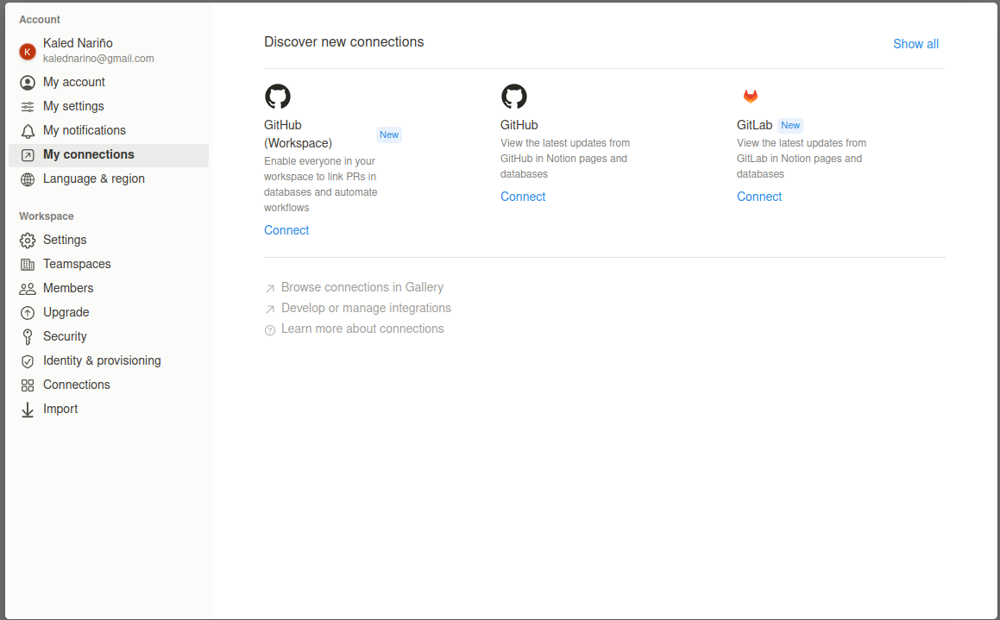

- Te conectas con tu repositorio: 

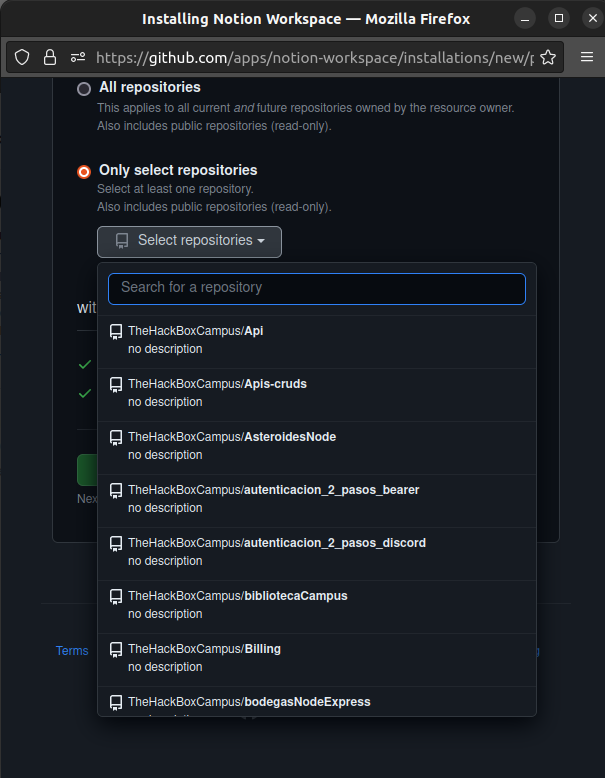

##### Listo prodras empezar a conectar tus PRs con Notion
- Lo primero que debemos hacer despues es en github clonar el repositorio o bien si 
ya lo tienes clonado, debes desarrollar la tarea y una vez desarrollada debes hacer commit desde tu rama en git.

- Una ves hacer commit y push, nos dirigimos a github y aparece la opcion de comparar el pull request

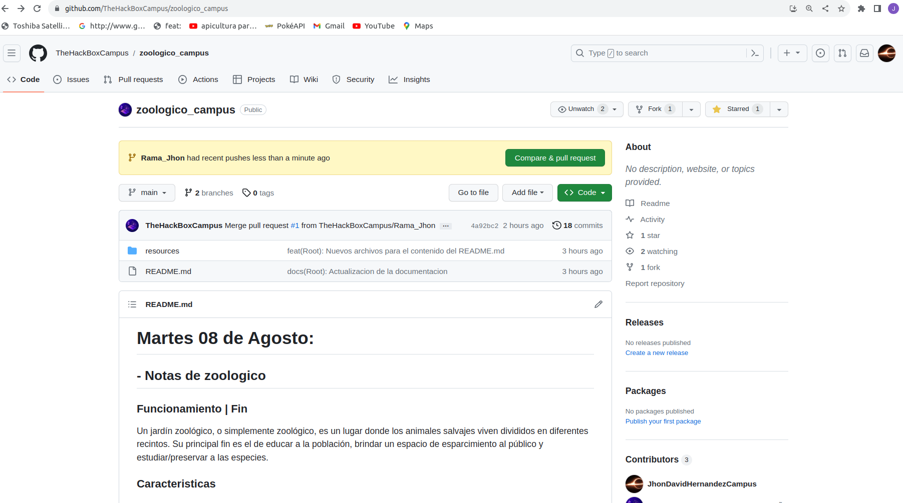

- Le damos click en Compare & pull request

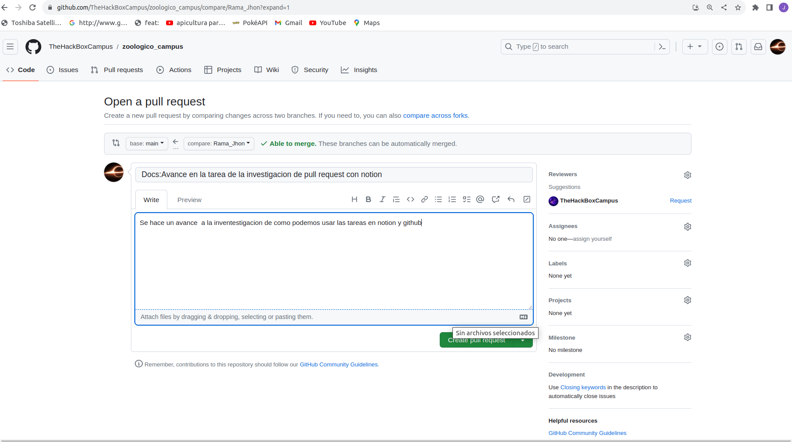

- Despues de esto nos queda hacer la conexion de este commit con notion asi que copiamos el link el pull request

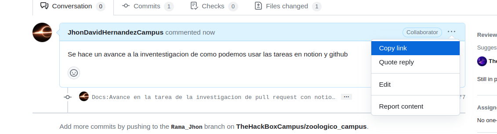

- Despues nos dirigimos a notion para hacer la conexion 


- Pegamos el link de nuestro pull request

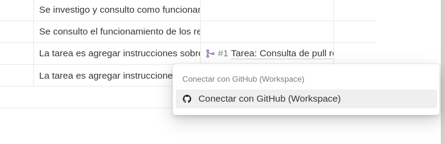

- Configuramos el repositorio

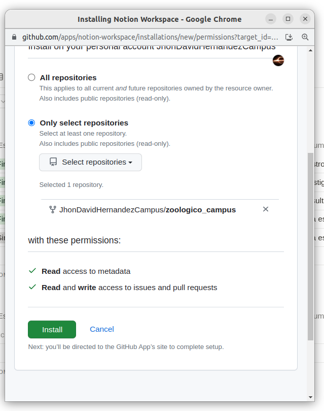

- Deberia quedarnos de la siguiente forma 

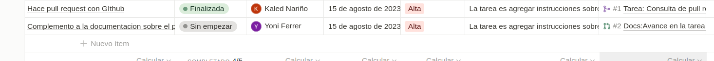


- Con estos pasos habremos conectado a notion con github, ahora cuando el lider asepte nuestra full request y haga merge a la rama 
automaticamente cambiara el estado de la tarea a realizada


# Miercoles 09 de Agosto:

## Release en github 

### Concepto de Release

Para entender que es un Release o lanzamiento es necesario que sepas que es una tag o etiqueta. 

### Tag    

Una etiqueta en GitHub es una referencia estática a un punto específico en el historial de versiones de un repositorio de código. Se utiliza para marcar hitos o versiones importantes en el desarrollo de un proyecto. Las etiquetas facilitan la identificación y el acceso rápido a versiones específicas del código, sin tener que buscar en el historial completo.

En resumen o en pocas las palabras las etiquetas se utilizan para marcar puntos específicos en el historial.

- ***Ahora ¿Que es un Release?***

Un release en GitHub es una versión específica de un proyecto que se presenta y documenta de manera organizada para su distribución. Se crea a partir de una etiqueta existente en el repositorio y contiene información detallada, como notas de lanzamiento, cambios y mejoras realizadas en esa versión. Los releases también pueden incluir archivos binarios o de instalación, lo que facilita a los usuarios acceder a la versión exacta y los recursos relacionados.

Si no te quedo muy claro te mostrare las diferencias con un ejemplo: 

### **Etiquetas (Tags):**

Imagina que tienes un repositorio de código y has estado trabajando en él durante un tiempo. Has llegado a un punto en el que sientes que has completado una versión importante de tu proyecto. Para marcar este hito, creas una etiqueta en el repositorio.

Ejemplo:

Has estado trabajando en un editor de texto y has añadido muchas características y arreglado errores.
Llegas a una versión que consideras "1.0.0" y decides marcarla con una etiqueta.
Creas una etiqueta llamada "v1.0.0" en el commit que representa esta versión.
La etiqueta "v1.0.0" marca este punto específico en el historial de versiones de tu repositorio. Ahora, cualquiera que mire el historial podrá ver que en este punto, se lanzó la versión "1.0.0" de tu proyecto.

### **Releases (Lanzamientos):**

Ahora, tomando el mismo ejemplo, vamos a hablar de cómo crear un release a partir de una etiqueta.

Supongamos que después de marcar la etiqueta "v1.0.0", decides crear un release para esta versión específica.

Ejemplo:

Creas un release con el título "Versión 1.0.0" y las notas de lanzamiento detallando todas las características nuevas y los errores corregidos en esta versión.
Adjuntas archivos binarios, como paquetes de instalación, junto con el release.
Publicas el release en GitHub.
El release "Versión 1.0.0" es ahora una página específica en tu repositorio que proporciona información detallada sobre esta versión. Las personas pueden acceder a las notas de lanzamiento y descargar los archivos adjuntos, lo que facilita para ellos obtener la versión exacta que lanzaste.

OK, ya que esta mas claro el concepto y las diferencias te mostrare como hacerlo en github: 

- Inicias Sesion con tus credenciales

- Entras al repositorio donde quiero crear el Release

- En la parte de la derecha, arriba de las seccion de packages encontraras la opcion de releases, le daras click en la opcion de ´´new releases´´ (Nuevos lanzamientos)

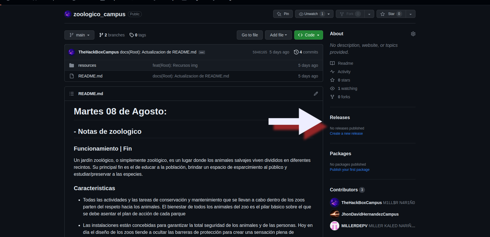

Completa la siguiente información en el formulario:

- Tag version (Versión de la etiqueta): Esto es generalmente un número de versión, como "v1.0.0".
Release title (Título del release): Un título descriptivo para el release.

- Write (Escribe): Aquí puedes proporcionar una descripción detallada de los cambios incluidos en este release. Puedes utilizar formato Markdown para dar formato al texto.

- Attach binaries (Adjuntar binarios): Si deseas adjuntar archivos binarios a este release, puedes hacerlo aquí.
Pre-release (Pre-lanzamiento): Si esta versión es una versión preliminar o de prueba, marca esta casilla.

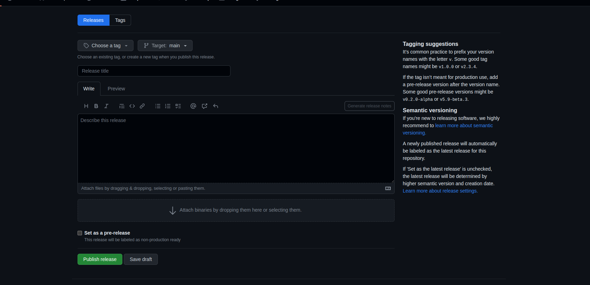

- Agrega cambios adicionales (opcional):
Si tienes un archivo "CHANGELOG" o una lista de cambios importantes, considera agregar un enlace o un resumen en el campo de escritura.

- Adjunta archivos binarios (opcional):
Si deseas adjuntar archivos binarios, como paquetes de instalación, haz clic en "Attach binaries" y selecciona los archivos relevantes.

- Publica el release:
Después de completar toda la información necesaria, haz clic en el botón "Publish release" (Publicar release). El release se creará y estará disponible para que otros usuarios lo vean y lo descarguen.

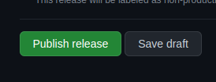

Una vez que hayas completado estos pasos, habrás creado un release en GitHub con la información que proporcionaste. Los releases son una excelente manera de organizar las diferentes versiones de tu proyecto y facilitar la descarga y el seguimiento de los cambios importantes.

------------------------------------------------------------------------------------------------------------------
# Domingo 3 de septiembre

## Inicialización del proyecto. 

- Clonamos el proyecto en un directorio. 
- Entramos al directorio clonado

```bash
> git clone https://github.com/TheHackBoxCampus/zoologico_campus.git
> cd zoologico_campus 
```
## Instalar las dependencias

```bash
npm update || npm i
```
## Crea el archivo de enviroments: 

- En la raiz del proyecto, crea un archivo ``.env``

- Configura las propiedades: Servidor de express, datos de mongodb atlas, key de token 

```text
SERVER={"...": "localhost", "port": ...}
USER_DB={"username": "...", "password": "...", "database": "..."}
KEY="..."
```

## Cluster de Mongo DB atlas

Para que podamos ejecutar el script ``'query.mongodb'`` tenemos que conectarnos con ``mongo``, existen varias formas de utilizar mongo
te puedes conectar al loopback o directamente al cloud con mongo db ``ATLAS``

En esta ocasión se estara utilizando ``mongodb atlas`` para registrar los documentos en la nube.

Requerimientos:

- Tener una cuenta de mongoDB ``atlas`` 
- ! si no tienes una cuenta puedes consultar este video y realizar el proceso: https://youtu.be/hXyIv_vKdUs
- Tener autenticacion para conectarse con ``atlas``, es decir consultar un enlace como el siguiente: 

```txt
> mongodb+srv://<user>:<password>@<cluster>/

// user => escriba su usuario
// password => escriba su contraseña
// cluster => consultelo en mongo atlas en su database. Es propio NO generico
``` 
- Una vez ya consultado puede conectarte con ``mongoDB compass`` o con la extension de **visual studio code** -> ``mongoDB`` 
 
### Mongo DB Compass

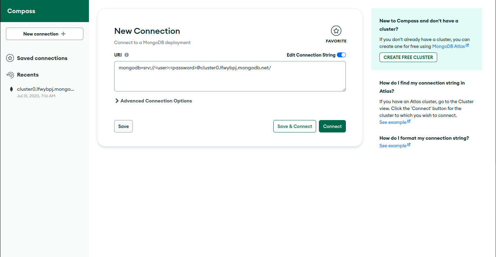

### Mongo DB Extension de VSCODE 

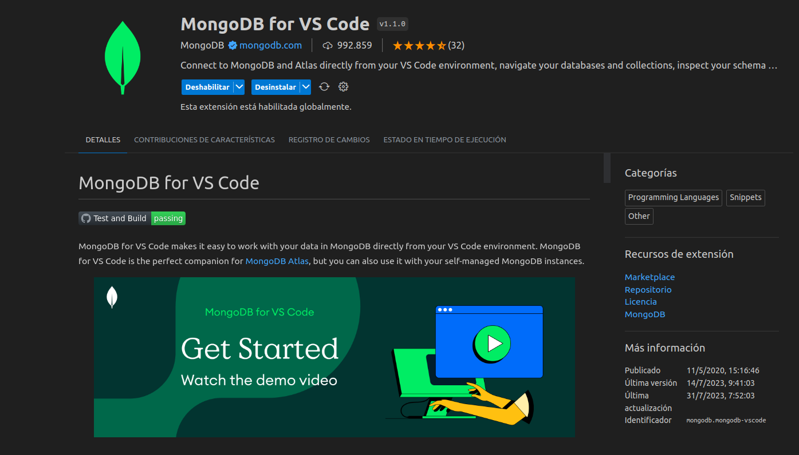

- Cualquiera de las 2 opciones son validas, depende de gusto y comodidad


## Modifica el cluster en el proyecto
- Una vez que tengas el cluster 
- Dirigite a la ruta ``src/config/db.js``
- Cambia el cluster:

#### Nota: La propiedad ``enviroments`` viene del archivo ``src/env/env.js``
```js
let credentials = JSON.parse(enviroments.USERDB); 
let uri = "mongodb+srv://${credentials.username}:${credentials.password}@<cluster>${credentials.database}" 
// Puedes cambiar el nombre de la variable o dejarlo asi.
// cambia el cluster por el que tienes en mongodb atlas
```

## Conexion a mongo db con el client 

- Te puedes conectar de esta forma:

```js
import { MongoClient } from "mongodb";
import enviroments from "../env/env.js";

const conx = async () => {
    try {
        let credentials = JSON.parse(globalProperties.USERDB);
        let uri = "mongodb+srv://${credentials.username}:${credentials.password}@<cluster>${credentials.database}";
        let options = {
            useNewUrlParser: true,
            useunifiedtopology: true
        }
        let client = await MongoClient.connect(uri, options);
        console.log("db --> success");
        return client.db(); 
    }catch(err) {
        console.error(err.message)
    }
}

export default conx; 
```
## Poner en escucha el servidor de express:

- En el archivo package.json
- Encontraras en los scripts. El siguiente comando: 

```json
"scripts": {
    "dev": "nodemon --quiet src/index.js"
}
```

- Para ejecutarlo y poner en escucha al servidor: escribe en la terminal

```bash
npm run dev
```

## ¿Como se configuro el servidor?

- ** EJEMPLO DE USO ** 
- Este ejemplo no tiene uso en el proyecto, es instructivo para el entendimiento del express.

Para que los endpoints tengan funcionamiento con el `` Router ``  de express, primero tenemos que desplegar un servidor 
```js
import express from 'express';
let app = express();

let config = {
    hostname : "IP",
    port: "port"
};

app.listen(config, () => {
    console.log(`server lanzado en http://${config.hostname}:${config.port}`);
})
```
Configuramos los middleware para que acepte valores json y de texto
```javascript
import express from 'express';
let app = express(); 
// middleware
app.use(express.text())
app.use(express.json())
```
Con el ``Router`` de express en nuestro archivo app.js definimos las rutas
```javascript
// importamos las rutas de nuestro archivo routes, /* mas informacion mas adelante */
import express from 'express';
import router from './router/routes.js'
let app = express(); 

app.use("consultas", router); 
```

## Enrutado con Router / Express 
### Consultas HTTP en Router / Express

- ** EJEMPLO DE USO ** 
- Este ejemplo no tiene uso en el proyecto, es instructivo para el entendimiento del router y la conexion de mongodb con el client.

- Importar el MODULO ``Router`` de express
- importar la conexión exportada de mongo db

```javascript
import { Router } from "express";
import { conx } from "../config/db.js";

let router = Router(); 

// diferentes metodos get, post, put, delete
router.get("/", async (req, res) => {
    let db = await conx();
    let bodegas = await db.collection("bodegas");
    let consulta = await bodegas.find().toArray(); 
    res.send(consulta)
} )
```
### Dependencias del proyecto 

## JWT (Json Web Tokens)
Los datos estan un poco mas sanitizados pero ¿Cómo puedo autorizar al usuario o dar permisos al usuario?, El algoritmo HS256 del tipo JWT permite crear tokens, que son los tokens, El token es una referencia (un identificador) que regresa a los datos sensibles a través de un sistema de tokenización.

### ¿Que funcionamiento tienen los tokens?
En el mismo se define un mecanismo para poder propagar entre dos partes, y de forma segura, la identidad de un determinado usuario, además con una serie de claims o privilegios.

Estos privilegios están codificados en objetos de tipo JSON, que se incrustan dentro de del payload o cuerpo de un mensaje que va firmado digitalmente.

### Ejemplo de token


### Estructura de un token 


* Header: encabezado dónde se indica, al menos, el algoritmo y el tipo de token, que en el caso del ejemplo anterior era el algoritmo HS256 y un token JWT.

* Payload: donde aparecen los datos de usuario y privilegios, así como toda la información que queramos añadir, todos los datos que creamos convenientes.

* Signature: una firma que nos permite verificar si el token es válido, y aquí es donde radica el quid de la cuestión, ya que si estamos tratando de hacer una comunicación segura entre partes y hemos visto que podemos coger cualquier token y ver su contenido con una herramienta sencilla, ¿dónde reside entonces la potencia de todo esto?


### Ejemplo en codigo 
Para la utilización del token JWT, se puede implementar con la libreria jsonwebtokens, pero en este caso aprovechando los modulos de la libreria ``jose``
```js
import jwt from "jsonwebtoken";
```
Verificar el token:
```js
// jwtverify
 jwt.verify(token, enviroments.KEY, { algorithms: "HS256" }, (err, decoded) => {
        err ? cb(err) : cb(null, decoded, { scope: "*" })
})
```
Crear el token:
```js
// Sign
 let token = new Promise((resolve, reject) => {
    jwt.sign(payload, enviroments.KEY, {algorithm: "HS256", expiresIn: "10m"}, (err, token) => {
         err ? reject(err) : resolve(token) 
    })
})
```

## Passport-http-Bearer

Informacion Oficial:

**"El módulo Passport-http-bearer proporciona una estrategia Passport para autenticar tokens de portador utilizados de acuerdo con el esquema de autenticación de HTTP Bearer.**

**Los tokens de portador son una credencial que puede utilizar cualquier parte en posesión del token para obtener acceso a un recurso protegido. El uso de un token de portador no requiere ninguna credencial adicional, como una clave criptográfica. Como tales, los tokens al portador deben protegerse contra la divulgación tanto en el almacenamiento como en el transporte para poder utilizarlos de forma segura.**

**El esquema de autenticación de Bearer está especificado por RFC 6750. Este esquema fue diseñado para usarse con tokens de acceso emitidos usando OAuth 2.0. Sin embargo, este esquema se puede utilizar dentro del marco general de autenticación HTTP (RFC 7235) y también se puede utilizar para autenticar tokens de portador emitidos a través de otros mecanismos".**


### Ejemplo de uso

- importa la estrategia 
```js
import {Strategy as BearerStrategy} from "passport-http-bearer"
```

- Ejemplo generico para la configuración de la libreria.
 
```js
new BearerStrategy(function(token, cb) {
  tokens.findOne({ value: token }, function(err, claims) {
    if (err) { return cb(err); }
    if (!claims) { return cb(null, false); }

    users.findOne({ id: claims.userID }, function (err, user) {
      if (err) { return cb(err); }
      if (!user) { return cb(null, false); }
      return cb(null, user, { scope: claims.scope });
    });
  });
});
```

## Express-rate-limit 

Informacion Oficial: 

**La limitación de velocidad es una estrategia que puede utilizar para controlar el tráfico en una red. Limita la cantidad de solicitudes que un usuario puede realizar dentro de un período de tiempo específico.**

Ejemplo de uso: 

- Configuracion 

```js
import rateLimit from 'express-rate-limit'

const limiter = rateLimit({
	windowMs: 15 * 60 * 1000, // 15 minutes
	max: 100, // Limit each IP to 100 requests per `window` (here, per 15 minutes)
	standardHeaders: true, // Return rate limit info in the `RateLimit-*` headers
	legacyHeaders: false, // Disable the `X-RateLimit-*` headers
	// store: ... , // Use an external store for more precise rate limiting
})
```

- Utiliza la funcion limiter en las rutas 
- Pasalo como middleware

```js
router.get("/", limiter(), (req, res) => res.send("hello world!"))
```

## Express-routes-versioning

Lo que nos permite es colocar o hacer versionados para nuestras rutas, muchas veces nos vamos a encontrar en esos casos donde es necesario corregir un error o modificar y refactorizar mejor el funcionamiento de la api, asi como en github podemos generar diversos tags para las versiones de nuestro proyecto, podemos hacerlo atraves de codigo con esta dependencia, distribuyendo y haciendo mas escalables nuestras APIs

Ejemplo de uso: 

** Ejemplo generico **

```js
import routesVersioning from "express-routes-versioning";
import {Router} from "express"; 
import controller from "../controllers"

// instancia de la dependencia para el correcto uso, ya que por defecto viene en modulos commond.js
const version = routesVersioning(); 

// ruta de ejemplo
let RouteX = Router(); 

RouteX.get("/", ...middlewares /* configuras tus middlewares */, version({
    "1.0.0": controller // el modulo que quieres ejecutar
}))
```
## Express-validator 
Express Validator es un conjunto de middlewares de validación y saneamiento para Express.js. Proporciona una forma sencilla y flexible de validar datos en las solicitudes HTTP entrantes.

Puede validar cualquier tipo de datos, incluyendo parámetros de ruta, parámetros de consulta, cuerpos de solicitud y encabezados. También proporciona funciones para limpiar o "sanear" los datos, lo que puede ayudar a proteger su aplicación contra ataques como la inyección de SQL.

**EJEMPLO GENERICO**

```js
import { check, validationResult } from 'express-validator';

app.post('/user', [
  // el nombre de usuario debe ser un correo electrónico
  check('username').isEmail(),
  // la contraseña debe tener al menos 5 caracteres
  check('password').isLength({ min: 5 })
], (req, res) => {
  // Encuentra los errores de validación en esta solicitud y los envuelve en un objeto con funciones útiles
  const errors = validationResult(req);
  if (!errors.isEmpty()) {
    return res.status(400).json({ errors: errors.array() });
  }

  User.create({
    username: req.body.username,
    password: req.body.password
  }).then(user => res.json(user));
});
```
## Funcionamiento del proyecto: 

- Ruta principal 

```text
http://${hostname}:${port}/
```

## Generar token: 

```txt
GET => http://${hostname}:${port}/login
```

- Datos de entrada: 

```json
{
    "id": ...
}
```
- Dato numerico 
- El nombre del parametro es obligatorio
- Nombre del parametro es ``id``
- **En otros casos recibiras excepciones**

### Descripcion del endpoint 

Este endpoint genera un token, el cual debera ser colocado en el ``Bearer`` de los otros endpoints documentados en la parte inferior. 

----------------------------------------------------------------------------------------------------------------
## Listar animales
```txt
GET => http://${hostname}:${port}/animales
```

- No necesita datos de entrada
- Necesita autenticacion 
- **En otros casos recibiras excepciones**

### Descripcion del endpoint 
```txt
- Listar todos los animales registrados en la base de datos
```
----------------------------------------------------------------------------------------------------------------

## Listar animales especificos
```txt
GET => http://${hostname}:${port}/animales/:id
```

### Parametros requeridos
- El parametro debe ser un dato numerico 
- Necesita autenticacion 
- **En caso contrario no recibiras datos de salida**

### Desripcion de la consulta
```txt
- Listar los animales por id especifico
```
----------------------------------------------------------------------------------------------------------------

## Mostrar especies por nombre
```txt
GET => http://${hostname}:${port}/animal
```

### Query necesitada 

- Debes mandar el nombre de la especie
```txt
GET => http://${hostname}:${port}/animal?specie=...
```
- cadena de texto
- Necesita autenticacion 
- **En caso contrario no recibiras datos de salida**

### Descripcion del endpoint 
```txt
- Listar especies especificas
```
----------------------------------------------------------------------------------------------------------------
## Cantidad de especies
```txt
GET => http://${hostname}:${port}/cantidad/especie
```

- No necesita datos de entrada
- Necesita autenticacion 
- **En otros casos recibiras excepciones**

### Descripcion del endpoint 
```txt
- Lista la cantidad de especies que hay por animal, registrados actualmente en la base de datos
```
----------------------------------------------------------------------------------------------------------------
## Listar todas las especies con sus subespecies 
```txt
GET => http://${hostname}:${port}/especies
```
- No necesita datos de entrada
- Necesita autenticacion 
- **En otros casos recibiras excepciones**

### Descripcion del endpoint 
```txt
- Listar todas las especies con sus subespecies 
```
----------------------------------------------------------------------------------------------------------------
## Listar todas las alimentaciones 
```txt
GET => http://${hostname}:${port}/alimentacion
```
- No necesita datos de entrada
- Necesita autenticacion 
- **En otros casos recibiras excepciones**

### Descripcion del endpoint 
```txt
- Listar todos los animales registrados en la base de datos
```
----------------------------------------------------------------------------------------------------------------
## Listar alimentacion especifica
```txt
GET => http://${hostname}:${port}/alimentacion/:id_alimentacion
```
### Parametros requeridos
- El parametro debe ser un dato numerico 
- Necesita autenticacion 
- **En caso contrario no recibiras datos de salida**

### Descripcion del endpoint 
```txt
- Listar alimentacion por id especifico
```
----------------------------------------------------------------------------------------------------------------
## Listar alimentacion de categoria de animal
```txt
GET => http://${hostname}:${port}/alimentacion/animal/:nombre_animal
```
### Parametros requeridos
- El parametro debe ser una cadena de texto
- Necesita autenticacion 
- **En caso contrario no recibiras datos de salida**

```txt
- Listar alimentacion por categoria de nombre especifico 
```
----------------------------------------------------------------------------------------------------------------
## Agregar alimentaciones a animales
```txt
POST => http://${hostname}:${port}/alimentacion/insertar
```
- Datos de entrada: 

```json
{
    "id_animal": ...,
    "tipo_alimento": "...",
    "hora_alimentacion": "...",
    "cantidad": ...
}
```
- id_animal => debe ser un dato numerico
- tipo_alimento => Cadena de caracteres
- hora_alimentacion => Cadena de caracteres
- cantidad => debe ser un dato numerico
- **En otros casos recibiras excepciones**

## Contacto 
integrantes: 

- Miller Kaled Nariño Ibarra | kalednarino@gmail.com

- Jhon David Hernandez Ferrer | yonif975@gmail.com

